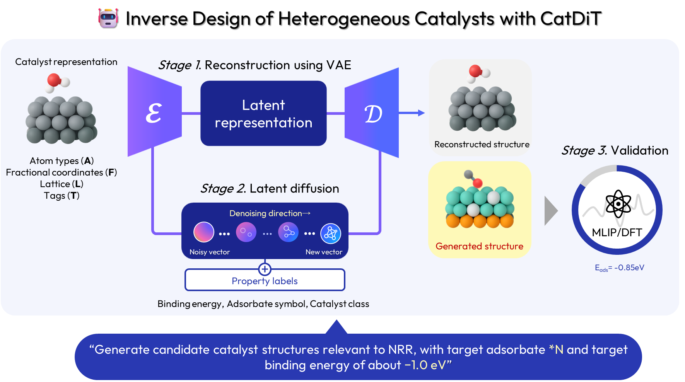

# Catalyst Diffusion Transformer (CatDiT)
<!-- [](링크크) -->
[](https://github.com/doouv/CatDiT.git)
[](https://huggingface.co/doouv/catalyst-diffusion-transformer)
[](https://colab.research.google.com/github/doouv/CatDiT/blob/main/notebooks/catdit_demo.ipynb)

## Overview


**CatDiT** is a latent diffusion model for inverse catalyst design, built upon
[ADiT](https://github.com/facebookresearch/all-atom-diffusion-transformer). A
first-stage equivariant VAE compresses catalyst structures into a latent space,
and a second-stage diffusion transformer (DiT) learns to generate new structures
in that space under desired property conditions. The generated latents are then
decoded back into full atomic structures (atom types, fractional coordinates, lattice, and atom tags).

<p align="center">
  
</p>

**Key features**

- **Property-guided generation**: condition on binding energy, adsorbate, and
  catalyst class to steer generation toward target property.
- **Expanded chemical space**: jointly trained on alloys and oxides (OC20 + OC22),
  covering a broader range of catalysts.
- **Fast inference**: flow-matching in a compact latent space gives short
  sampling times relative to typical diffusion models.
- **Large structures**: generates catalyst systems with up to 225 atoms.

## Installation

```bash
git clone https://github.com/doouv/CatDiT.git
cd CatDiT
```

**Option A — conda (bare-metal server).** Creates the pinned `catdit` env:

```bash
bash setup.sh
conda activate catdit
```

**Option B — Docker.** Builds an image with the full environment:

```bash
docker build -t catdit .
docker run -it -d --gpus='"device=<n>"' --name <catdit> -v </path/to/workspace>:/workspace catdit:latest

```
> ⚠️ This repo pins an older (deprecated) version of fairchem for data
> preprocessing. If you also need other fairchem tools, consider creating a
> separate conda env inside the container via `setup.sh` to avoid version conflicts.

## Pretrained models

You can download pretrained models [here](https://huggingface.co/doouv/catalyst-diffusion-transformer).

Each LDM checkpoint is paired with a VAE checkpoint. After downloading both, set
`ckpt_path` (the LDM) and `autoencoder_ckpt` (the paired VAE) in
`configs/generate_samples.yaml`.

## Data

Training data (OC20 + OC22) is downloaded and preprocessed **automatically** on
the first training run. The dataset classes in
`src/data/components/oc20_dataset.py` and `src/data/components/oc22_dataset.py`
fetch the raw `.tar` / LMDB files from the Open Catalyst Project servers, extract
them, and cache processed `.pt` files under the data directory (`paths.data_dir`).
No manual download is needed — just ensure enough disk space and network access
on the first run.

## Training

Training runs in two stages: the
diffusion model operates in the latent space defined by the VAE, so the LDM
needs a trained VAE checkpoint to encode/decode structures.

All training options (data paths, model size, optimizer, number of epochs, and
the VAE checkpoint used by the LDM) live in the Hydra configs — edit
`configs/train_autoencoder.yaml` and `configs/train_diffusion.yaml`.

```bash
# Stage 1: VAE (first-stage autoencoder)
python src/train_autoencoder.py

# Stage 2: latent diffusion transformer
python src/train_diffusion.py
```

For multi-GPU training, use the DDP launchers, which wrap each stage with the
appropriate distributed settings:

```bash
bash scripts/train_vae_ddp.sh   # Stage 1
bash scripts/train_ldm_ddp.sh   # Stage 2
```

All models in this work were trained on NVIDIA H200 GPUs.

## Inference / Generation

The quickest way to try generation is the [Colab notebook](https://colab.research.google.com/github/doouv/CatDiT/blob/main/notebooks/catdit_demo.ipynb) (no local setup needed).

To run locally, set the checkpoint paths and generation settings in
`configs/generate_samples.yaml` — `ckpt_path` (the LDM), `autoencoder_ckpt`
(the paired VAE), `sampling.num_samples`, and the `conditional_generation`
block (binding energy / adsorbate / catalyst class) for property-guided
generation. Then run:

```bash
python src/generate_samples.py
```

## MLIP relaxation for evaluation

Relax generated structures and compute adsorption energies using
[SevenNet-Omni](https://github.com/MDIL-SNU/SevenNet). The
script automatically sets the modal (or channels) by distinguishing whether
lattice oxygen exists or not.

```bash
# single generation run
python src/7net_relaxation.py --path <run_dir>          # run_dir contains generated/

# sweep runs
python scripts/sweep_be_relaxation.py --path <logs/sweep/run_YYYY-MM-DD>
```

Use `--inspect 0 1 2` to relax only specific indices, `--device cpu` to run on CPU.

## Sweep (conditional generation over a parameter grid)

```bash
# 1. create the sweep
wandb sweep configs/sweep/generate_sweep_<condition>.yaml

# 2. launch an agent with the printed sweep ID
wandb agent <your-entity>/<project>/<sweep_id>
```

## Citation

<!-- TODO -->

## License

<!-- TODO -->
